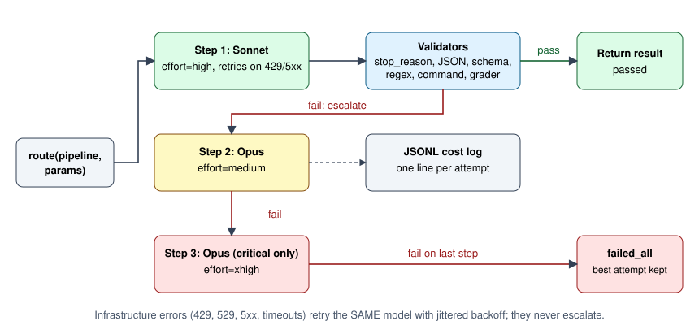

# edgeworks-router

A Sonnet-first LLM escalation ladder with validators, per-attempt cost logging and Message Batches support.
Implemented twice (Python and TypeScript) against one shared contract and one shared config file. Version 0.1.0.

## The problem

Most LLM calls in a product do not need the most expensive model, but the few that do are hard to predict.
Sending everything to the top model wastes money; sending everything to the cheap model ships wrong answers.
What you want is: try the cheap model, check the answer with something deterministic, and only pay for the
bigger model when the check fails. And you want a log that proves whether that trade is paying off.

## How it works



```
route(pipeline, params)
        |
        v
  +-------------+   pass   +----------------+
  | Step 1      |--------->| return result  |
  | Sonnet/high |          +----------------+
  +-------------+
        | validators fail (or stop_reason is max_tokens / refusal / ...)
        v
  +-------------+   pass   +----------------+
  | Step 2      |--------->| return result  |
  | Opus/medium |          +----------------+
  +-------------+
        | fail
        v
  +-------------------------+   pass   +----------------+
  | Step 3 (critical only)  |--------->| return result  |
  | Opus/xhigh              |          +----------------+
  +-------------------------+
        | fail
        v
  failed_all: best-scoring attempt is returned, never silently

  every attempt -> one JSONL line (tokens, cost, latency, reason, escalated)
  infra errors (429/529/5xx/timeout) -> retry the SAME model with jittered backoff, never escalate
```

* `routing.json` is the single config both languages read: model aliases, pricing, the default ladder,
  and named pipelines (validators, optional Haiku grader, batchable/critical flags, optional pinned model).
* Validators are deterministic where possible: `json`, `json_schema` (zero-dependency subset), `required_fields`,
  `tool_use`, `length`, `regex`, `banned_phrases`, `command` (runs a process on the output), `custom` (in-process).
  When no deterministic check exists, an optional Haiku grader scores the output against a rubric.
* Requests are adapted to current API rules and every adaptation is recorded (for example forced `tool_choice`
  becomes `auto` plus strict tools, unsupported sampling parameters are dropped).
* Cost is computed from the model that actually served the response, including cache read/write tokens and the
  Batch discount.
* `route_batch` submits step 1 as one Message Batch, then resubmits only the failures at the next step.
* `router report` aggregates the logs per pipeline: escalation rate, pass rate per step, spend, an estimate of
  what an Opus-only policy would have cost, and a recommendation (`PIN TO OPUS`, `TRY SONNET MEDIUM`, `KEEP`).
* Human rejection: `router reject <task_id> --reason ...` re-runs a stored payload starting at the first Opus step.

The full contract (log schema, adaptation rules, batch semantics) is in [SPEC.md](SPEC.md).
Model IDs and prices in `routing.json` are configuration, not code; edit them to match your account.

## Layout

```
routing.json              shared config (models, pricing, ladder, pipelines)
SPEC.md                   shared contract for both implementations
python/                   edgeworks_router package, `router` CLI, pytest suite
ts/                       @edgeworks/router: browser-safe core + Node file sink, vitest suite
shared/fixtures/          parity cases both test suites must pass
examples/offline_demo.py  runnable demo with a scripted client (no network)
```

## Usage

Python (3.11+):

```bash
cd python
pip install -e ".[test]"
export ANTHROPIC_API_KEY=...        # never logged or persisted
```

```python
from edgeworks_router import route

# Loads routing.json (EDGEWORKS_ROUTING_JSON, else the repo checkout) and writes logs under EDGEWORKS_ROUTER_HOME.
res = route("extract-ticket-fields", {
    "max_tokens": 300,
    "messages": [{"role": "user", "content": "Extract category, priority, summary as JSON: ..."}],
})
print(res.status, res.final_step, res.total_cost_usd, res.output)
```

CLI:

```bash
router report --days 30        # per-pipeline escalation/cost report
router spend                   # total spend across all logs
router reject <task_id> --reason "wrong category"
router batch <pipeline> items.jsonl --out results.jsonl
```

TypeScript (Node 18+; the `core` entry has zero runtime dependencies and takes an injectable `fetch` and sink):

```ts
import { createNodeRouter } from "@edgeworks/router/node";
const router = createNodeRouter({});
const res = await router.route("extract-ticket-fields", { max_tokens: 300, messages: [/* ... */] });
```

Environment: `ANTHROPIC_API_KEY`, `EDGEWORKS_ROUTER_HOME` (where `logs/` lives, default the repo root),
`EDGEWORKS_ROUTING_JSON` (alternate config), `EDGEWORKS_ROUTER_SPEND_CAP_USD` (optional hard cap checked before every call).

## A real run

This is the actual output of `python examples/offline_demo.py`. It runs the real router, validators, cost math,
logging and report against a scripted stand-in for the API client (no network, no API key), so the model replies
are canned but everything the router does with them is real. Task B's first reply is prose, fails the `json`
validator, and escalates to Opus.

```text
task A:
  -> API call: model=claude-sonnet-5-5 effort=high
  status=passed final_step=1 cost=$0.002400
  attempts=[(1, 'claude-sonnet-5-5', True, None)]
task B:
  -> API call: model=claude-sonnet-5-5 effort=high
  -> API call: model=claude-opus-5-5 effort=medium
  status=escalated_passed final_step=2 cost=$0.006900
  attempts=[(1, 'claude-sonnet-5-5', False, 'json_parse'), (2, 'claude-opus-5-5', True, None)]

log lines (logs/router-YYYY-MM.jsonl):
  {"pipeline": "extract-ticket-fields", "step": 1, "requested_model": "claude-sonnet-5-5", "effort": "high", "input_tokens": 900, "output_tokens": 60, "cost_usd": 0.0024, "validation_passed": true, "validation_reason": null, "escalated": false, "final": true}
  {"pipeline": "extract-ticket-fields", "step": 1, "requested_model": "claude-sonnet-5-5", "effort": "high", "input_tokens": 900, "output_tokens": 40, "cost_usd": 0.0022, "validation_passed": false, "validation_reason": "json_parse", "escalated": true, "final": false}
  {"pipeline": "extract-ticket-fields", "step": 2, "requested_model": "claude-opus-5-5", "effort": "medium", "input_tokens": 900, "output_tokens": 55, "cost_usd": 0.0047, "validation_passed": true, "validation_reason": null, "escalated": false, "final": true}

edgeworks-router report - last 30 days
NOTE: opus_only_est is an ESTIMATE (first opus attempt cost, else step-1 tokens repriced at opus; grader excluded)

pipeline                      calls    esc%  pass rate by step              cost $  opus_only ESTIMATE $  savings $   sav %  RECOMMENDATION
-------------------------------------------------------------------------------------------------------------------------------------------
extract-ticket-fields             2   50.0%  s1:50%(n=2) s2:100%(n=1)       0.0093                0.0095     0.0002     2.1  PIN TO OPUS  [pin: esc=0.5 n=2 >0.4? | medium: s1pass=0.5 n=2 >0.95?]
-------------------------------------------------------------------------------------------------------------------------------------------
TOTAL                             2                                         0.0093                0.0095     0.0002     2.1
```

## Tests

```bash
cd python && pip install -e ".[test]" && pytest          # 53 passed
cd ts && npm ci && npm test                              # 68 passed (6 files)
```

The TypeScript suite also drives the real Python router over the same cases and requires byte-identical log
lines and payloads (the cross-language parity test). It uses `python/.venv` if present, else `python` on PATH,
or `EDGEWORKS_XLANG_PYTHON`; it skips itself if that interpreter cannot import pytest.

Actual output:

```text
$ cd python && pytest -q
.....................................................                    [100%]
53 passed in 1.04s

$ cd ts && npm test
 ✓ test/core-purity.test.ts (1 test)
 ✓ test/batch.test.ts (3 tests)
 ✓ test/parity.test.ts (8 tests)
 ✓ test/router.test.ts (23 tests)
 ✓ test/node.test.ts (6 tests)
 ✓ test/xlang.test.ts (27 tests)
 Test Files  6 passed (6)
      Tests  68 passed (68)
```

## Status and limits

* v0.1.0. The test suites and the demo use mocked clients and make no live API calls; point it at your own key and a low `EDGEWORKS_ROUTER_SPEND_CAP_USD` before trusting it with real traffic.
* The savings figure in `router report` is an estimate, and says so in its header.
* Model IDs, prices and API behavior notes in `routing.json` / `SPEC.md` were accurate when written and should be
  re-checked against the provider docs before you rely on them.

## License

MIT. See [LICENSE](LICENSE).
